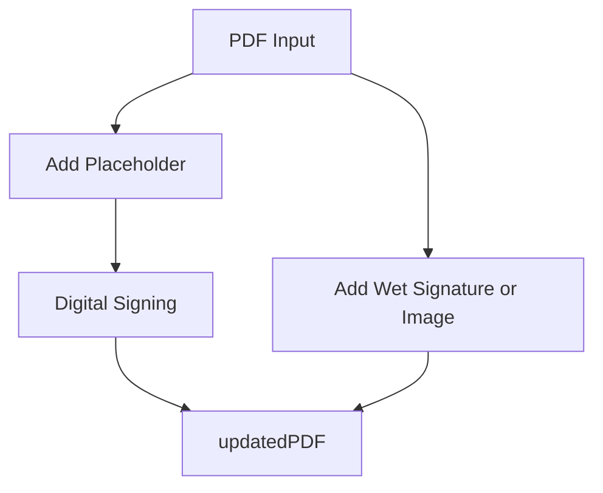

# H3S PDF Utility SDK

`H3SPDFUTIL` SDK is a **lightweight iOS SDK** for PDF signing.  
It supports **digital PKCS#12 signatures**, **wet signatures**, and **signature placeholders** while providing **offline license enforcement**.

---
## Features
- Add **signature placeholders** with metadata.  
- Add **wet signatures** (image-based).  
- Sign documents digitally using **PKCS# signature data**.  
- Keep track of updated PDF data via `updatedPDF`.  
- Supports **async/await** APIs for smooth integration.  
- Built-in **logging** via `LogLevel`.  
---
## Workflow Diagram


> This diagram shows the typical flow: the PDF data enters the SDK, create placeholders (with optional info) and digitally signed, and results in `updatedPDF`. Optionally, even you can add Wet signature and results in `updatedPDF`.
---
## Quick Start
This guide walks you through **installation, licensing, and your first signature**.

### Installation
#### Swift Package Manager
Add this to your `Package.swift`:

```swift
.package(url: "https://github.com/h3sventures/H3S-PDFUtility.git", from: "1.0.0")

.target(
    name: "YourApp",
    dependencies: ["H3SPDFUTILSDK"]
)
```
#### Initialize SDK
```swift
import H3SPDFUTIL

let pdfData: Data = ... // Your PDF data
let licenseKey = "YOUR_LICENSE_KEY"

let pdfSDK = H3SPDFUTILSDK(
    data: pdfData,
    licenseKey: licenseKey,
    logLevel: .info
)
```
`updatedPDF` will initially hold the input PDF data.

### Digital Signature
#### 1. Add Signature Placeholder
```swift
Task {
    do {
        let hashData = try await pdfSDK.addSignaturePlaceholder(
            additionalInfo: [
                PDFSignatureInfo(type: .name, value: "John Doe"),
                PDFSignatureInfo(type: .contactInfo, value: "john@example.com"),
                PDFSignatureInfo(type: .imageJpegBase64, value: "base64 string for image")
            ],
            placeholderLength: 16384,
            position: .bottomRight,
            onPage: .lastPage
        )
        print("Placeholder added. Hash: \(hashData?.base64EncodedString() ?? "N/A")")
    } catch {
        print("Failed to add placeholder: \(error)")
    }
}
```
**Parameters**:
- `additionalInfo`: Optional array of `PDFSignatureInfo`
- `placeholderLength`: Optional placeholder size (default: 16384)
- `position`: Optional `SignaturePosition` (default: `.bottomLeft`)
- `onPage`: Optional `SignaturePage` (default: `.lastPage`)
Returns the **computed hash** data stream.

#### 2. Sign Document
```swift
Task {
    do {
        let signatureData: Data = ... // PKCS# signature data
        let signedPDF = try await pdfSDK.signDocument(signatureData: signatureData)
        print("Document signed. Size: \(signedPDF?.count ?? 0) bytes")
    } catch {
        print("Failed to sign document: \(error)")
    }
}
```
**Parameter**: 
- `signatureData`: signature data stream
Returns the **signed PDF** data stream.

### Wet/Image Signature
#### 1. Add Wet Signature or Image
```swift
Task {
    do {
        try await pdfSDK.addWetSignatureOrImage(
            imageBase64: base64StringOfSignature,
            position: .bottomLeft,
            onPage: .firstPage
        )
        print("Wet signature added.")
    } catch {
        print("Failed to add wet signature: \(error)")
    }
}
```
**Parameters**:
- `imageBase64`: Base64-encoded image
- `position`: Optional `SignaturePosition` (default: `.bottomLeft`)
- `onPage`: Optional `SignaturePage` (default: `.lastPage`)

### Additional options
#### Access Updated PDF
```swift
let latestPDF = pdfSDK.updatedPDF
```

#### Logging
Set the `logLevel` during initialization:
```swift
enum LogLevel {
    case none, error, warning, info, debug
}
```
- `none`: No logs
- `error`: only errors
- `warning`: error and warnings
- `info`: Basic operation logs
- `debug`: Detailed logs for development

---
## API Reference

**Class**: `H3SPDFUTIL`
**Properties**
`updatedPDF: Data`
Holds the **latest PDF** after any operation (read-only).

**Initializer**
```swift
public init(data: Data, licenseKey: String, logLevel: LogLevel = .none)
```
- `data`: PDF as Data
- `licenseKey`: Your SDK license key string
- `logLevel`: Optional log verbosity

**Methods**
**1.** `addSignaturePlaceholder`
```swift
@MainActor
public func addSignaturePlaceholder(
    additionalInfo: [PDFSignatureInfo] = [],
    placeholderLength: Int = 8192 * 2,
    position: SignaturePosition = .bottomLeft,
    onPage: SignaturePage = .lastPage
) async throws -> Data?
```
- Adds a **signature placeholder**
- Returns optional **hash data**
- Throws error on failure

**2.** `addWetSignatureOrImage`
```swift
@MainActor
public func addWetSignatureOrImage(
    imageBase64: String,
    position: SignaturePosition = .bottomLeft,
    onPage: SignaturePage = .lastPage
) async throws
```
- Adds a **wet signature or image** at specified page/position
- Updates `updatedPDF`
- Throws error on failure

**3.** `signDocument`
```swift
@MainActor
public func signDocument(signatureData: Data) async throws -> Data?
```
- Signs the PDF with **PKCS# signature data**
- Returns the **signed PDF data stream**
- Throws error on failure
---
### Notes
- Always read from `updatedPDF` after any operation
- Handle errors using `do/catch`
- Use async/await to avoid blocking the main thread
- Ensure your **license key** is valid and matches your app’s Bundle ID
---
### License
YourSDK requires a valid license key. Licenses are tied to **Bundle ID** and define enabled features.

#### Trial License key
Valid till **Nov 30, 2025**
```
eyJ1c3IiOiJIM1MgVmVudHVyZXMgKFRyaWFsKSIsImV4cCI6MTc2NDQ3ODgwMCwiYXVkIjpudWxsLCJkZW1vIjp0cnVlLCJmZWF0IjpbImRyYWciLCJkaWdpdGFsIiwid2V0IiwibXVsdGkiLCJoYXNoIl19.B5YX3bV6KV9kV9EmEYmuZRjhax4Y6unINiV3z8+Zvrg1nOPSQ9d3rrG/+PmYVMB48FNT/hQRt7Jw5nkFhVOWQ8U8Mags94Ln2Zf9HRRNKx5e5H+5+x2sx/tq33EwXkXgkwyV/2AM5JBRF/YFr+QFlBW0EgF/Bzw296qwX5cuG+R7cDRhSZcEKdWQNKfSjCj4ynGfC7xpG97ESxvG4e9vBqVuw7/ItYYGow4nX5s6mHB9prfip50XRapbjL8WFHi/PlSR9xnNdjcsrat4CWhLxwBAS+y5s8FW/RIxAYCx5Gn+ZhYWxVwWa+DegUDD/TMovFil+8XU/VGqfpnBgpjXfg==
```

---
### Support
- Email: `h3sventures@gmail.com`
- Feedback: Will love to hear from you! Please **submit your feedback** or **report issue** at https://forms.gle/uUf6T8BShyBygC479
